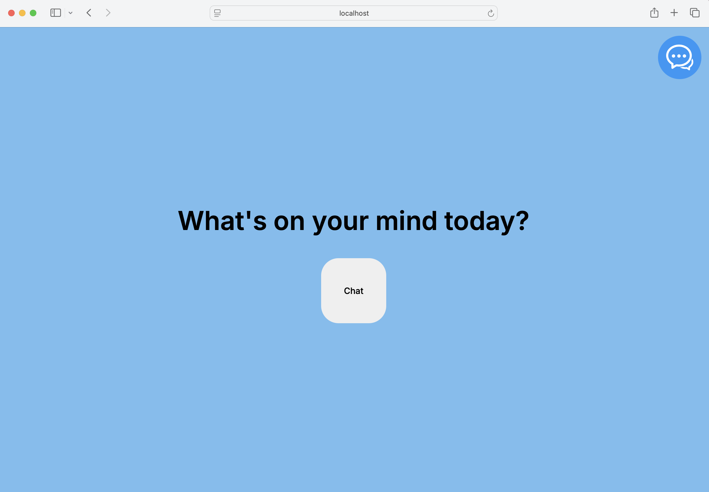
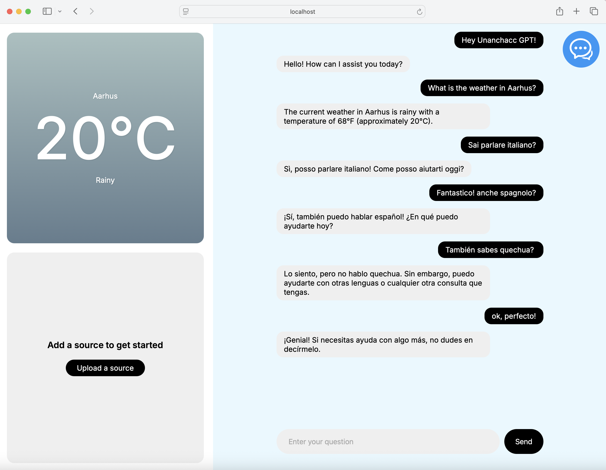

# unanchacc-gpt

Welcome to unanchacc-gpt! This conversational chatbot is driven by OpenAI’s GPT-4o, bringing you natural, intelligent, and engaging interactions.

## :pushpin: Introduction

This repository offers a simple template for implementing a chatbot interface. The chatbot backend supports streaming responses and integrates three built-in tools:

- [Code Interpreter](https://platform.openai.com/docs/assistants/tools/code-interpreter)
- [File Search](https://platform.openai.com/docs/assistants/tools/file-search)
- [Function Calling](https://platform.openai.com/docs/assistants/tools/function-calling)

This implementation is a modified version of OpenAI’s publicly available reference implementation.

:heavy_exclamation_mark: **This repository code is not intended for direct use in production**. This is a minimal chatbot template intended for demonstration purposes only. For production use, implement a robust client/server architecture and refactor the code to align with your conversational experience goals.


## :rocket: Setup

### 🌱  Install dependencies

```
npm install
```

### 🌱 Setting up env variables
You can use `.env` file for set the enviromental variables.
- Create an OpenAI API key at  [Open AI API Key](https://platform.openai.com/account/api-keys).
- Create an OpenAI Assistant at [Create Assistant](https://platform.openai.com/assistants). Be sure to enable file search and code interpreter tools.

```
OPENAI_API_KEY="SET_YOUR_API_KEY"
OPENAI_ASSISTANT_ID="SET_YOUR_ASSISTANT_ID"
```

## ✅ How to Use

This initializes the Unanchacc chatbot in your local environment.
```
npm run dev
```

Open the chatbot in your browser at [http://localhost:3000](http://localhost:3000).


## 🤖 Chatbot

The chatbot will appear as shown below—this is an example of its interface in the browser.



